# 【Re-API分享平台】By Reflux

## 完成的工作有：

1、制作阿里云OSS的starter，快速帮助新项目实现上传头像功能

2、上传头像后更新用户头像的事务处理

3、解决前端upload组件不会携带session请求的问题

4、使用JWT改造登录逻辑，使用ThreadLocal保存当前登录用户信息，解决session不能跨域以及无法应对分布式集群的问题

5、解决自定义拦截器与跨域拦截器冲突导致后端跨域处理全失效的问题

6、提供已登录用户签名优化的思路

7、编写通用调用接口方案，实现用户自定义上传接口（只要这个接口可用）

8、关键数据设置修改权限，让用户自定义上传接口时无法改变path路径（也就是后端处理第三方接口的路径）

9、接口上传的安全性问题：在接口调用失败后会使用默认参数再调用一次接口，看能否调用成功，失败则自动关闭接口

10、使用定时任务，定期清理长期失效的接口

11、解决Spring自调用事务失效问题

12、前端使用拦截器，拦截请求并给请求添加请求头，实现携带自定义请求头

13、复用管理端，让普通用户也可以自由对自己创建的接口进行增删改查。

14、使用maven子父依赖，方便打包

15、解决本地远程连接nacos报错fail to unregistered to (本机ip+28880)的问题

—————————————————————————————————

## 补充：

1、补全了接口端的全局异常处理和网关端的全局异常处理，让本地接口的可用性不再需要使用默认参数重测才知道是否可用

2、使用装饰器装饰网关响应，解决下层接口不存在返回whitelabel Error Page的问题

3、解决了bufferFactory.wrap写入不完全的问题

4、解决了dubbo警告：qos-server can not bind 的问题

5、初步改造成微服务

网关实现全局异常处理的好处是，统一异常的响应格式，让客户能知道自己为什么调用失败（比如签名错误，超时等），而不是只知道笼统的系统错误

## 后续计划：

1、修改使用分布式锁实现接口计数的思路，改用乐观锁，提高性能

2、尝试完善sdk的调用，使得后续不用传那么多参数来区分

3、学习限流技术，并运用到项目中.

暂时对现在的成果比较满意，前端参考nero哥的设计，特别感谢。

————————————————————————————————

## 流程图介绍：

流程图1是跨域拦截器失效后的简单处理方法

图2是使用跨域过滤器解决跨域拦截器失效的问题

图3是前端到接口端一条龙的调用逻辑，加了全局异常处理之后优雅了很多

图4是对于调用失败的各种处理逻辑

图5是网关端全局异常处理的好处展示

图6是不做处理调用接口异常的返回，很不雅（这个问题感觉没人注意....）

最后三张图是测试调用外部接口功能，直接偷取了一个免费接口。我写发布接口的时候会调用一次接口，只有调用成功才能发布，所以可以验证我们写的通用处理第三方接口的函数成功，让用户自主上传接口成为可能。

—————————————————————————————————

## 流程图：

跨域拦截器和自定义拦截器冲突后的解决方案1：

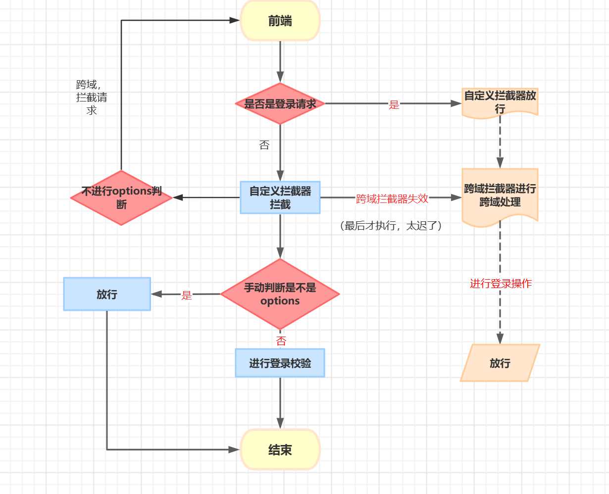

解决方案2：

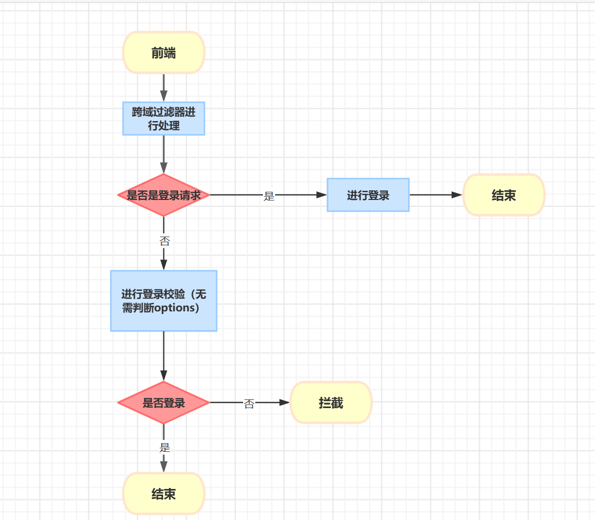

自顶向下的接口调用逻辑以及对接口返回值各种异常情况的处理：

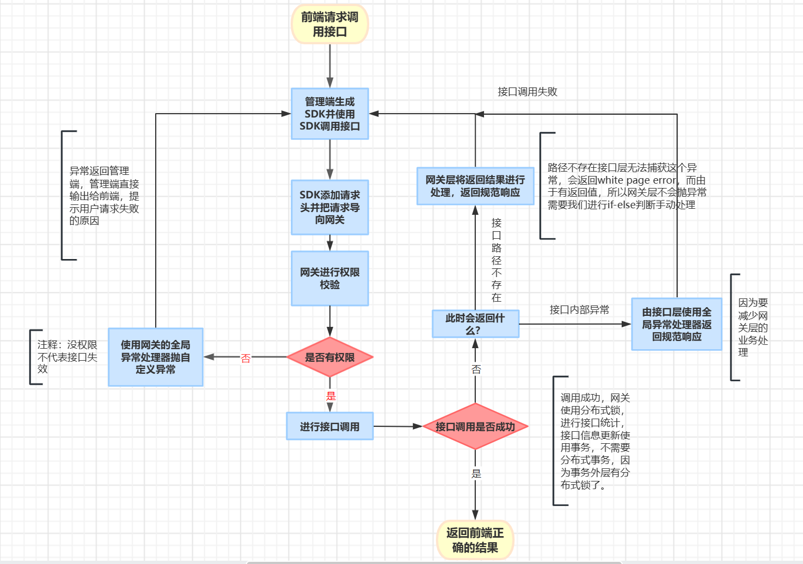

自底向上考虑的所有异常事件：

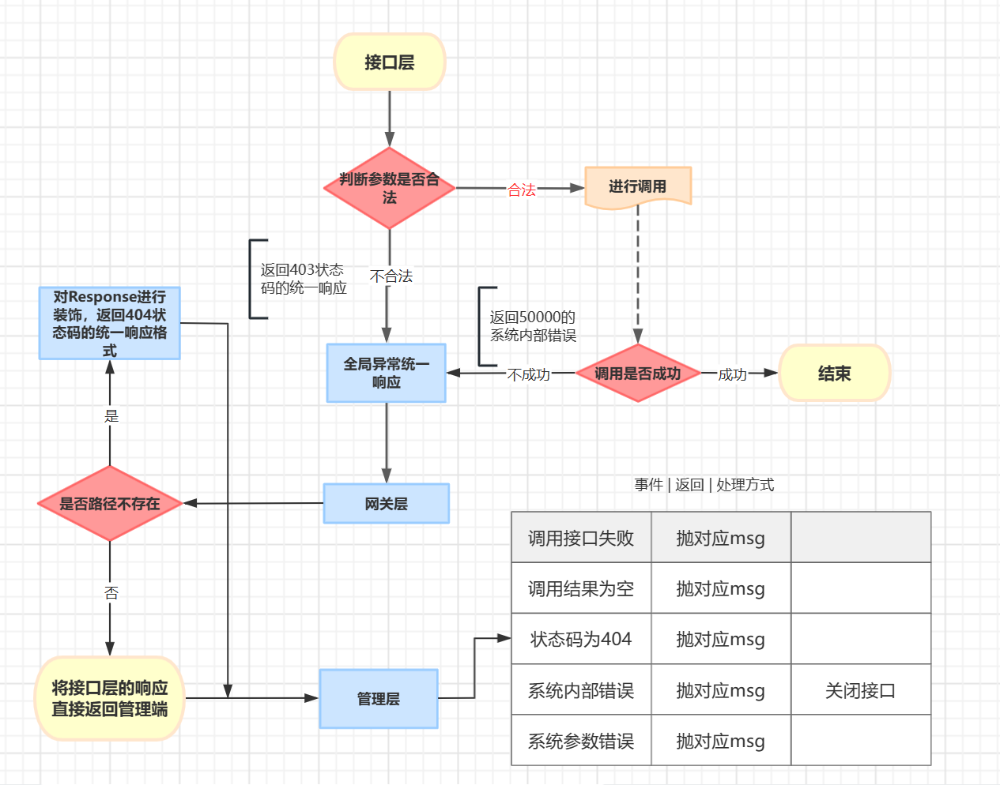

前端登录页面，可以注册，可以修改用户信息和上传头像

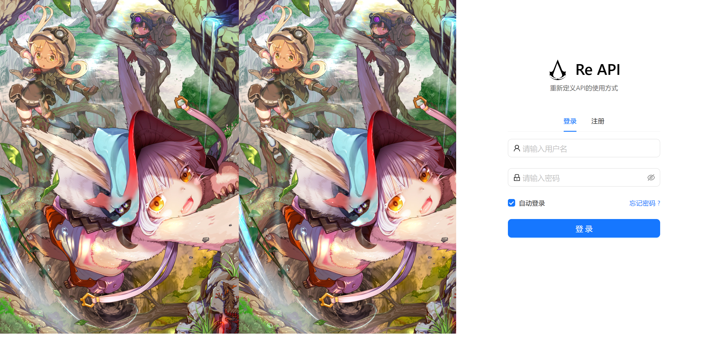

## 接口页面：

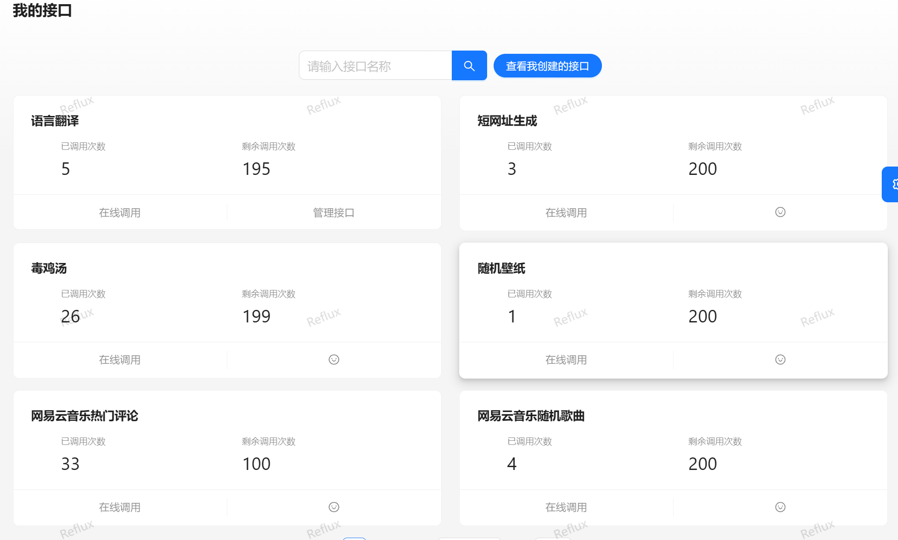

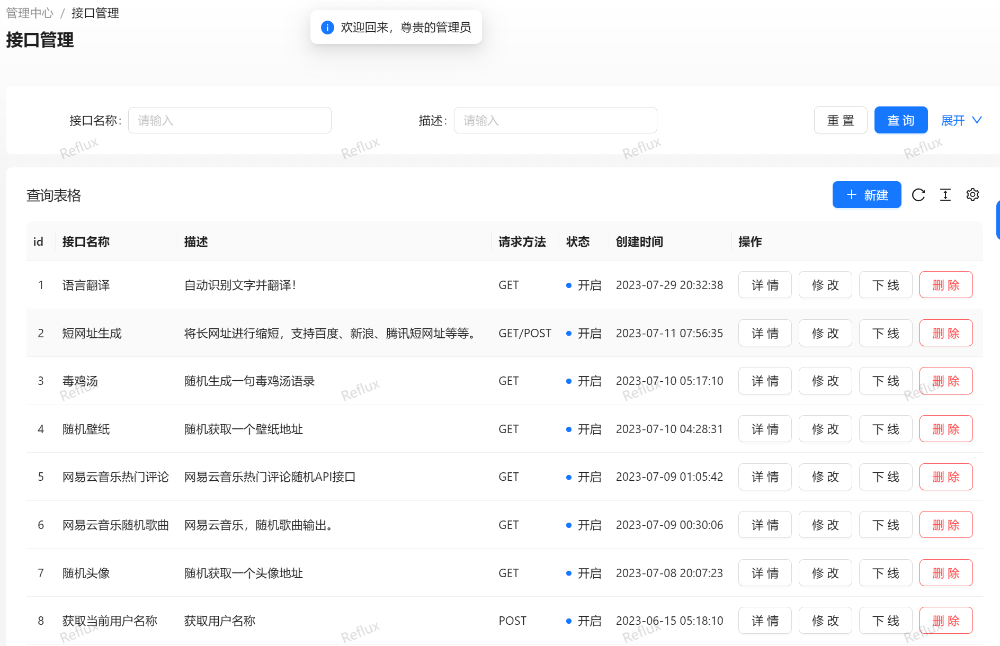

## 上传第三方接口：

无需入侵原本代码：

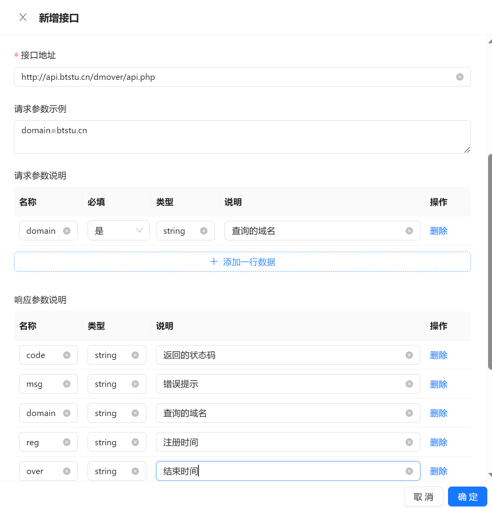

发布接口会自动调用一次接口，可以看到调用成功！也就是第三方接口添加并且可以调用

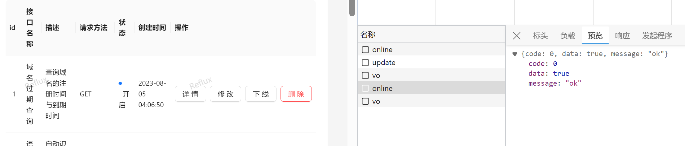

## 不进行异常处理的情况：

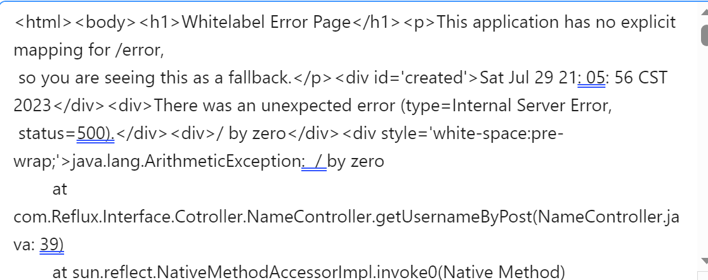

## 进行异常处理：

接口健壮性upupup！前端可以直接看到最底层微服务的失败提示信息，非常优雅！

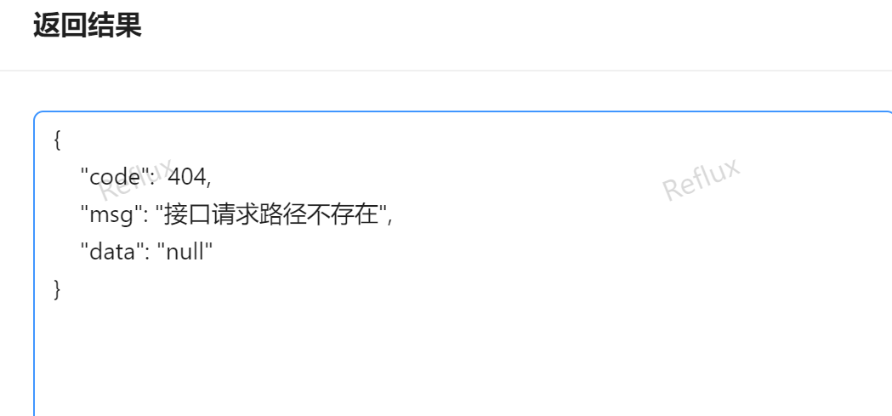

## 心得：

这个项目部署了4天才完成，期间遇到了无数的坑，最后终于完成，跑通所有流程，完成了自己想要的所有功能。笔记也写了2w2，希望这样能让秋招多点底气吧，只希望我的努力不要成为自娱自乐......

也希望我的笔记能帮助到后面的人。

PS：笔记记得很详细，如果想实现某个模块，比如接口可用性的判断那一块，或者使用JWT改造登录逻辑那一块，建议先看一遍，不要再跟着踩一轮坑了，哈哈。有些比较复杂的，也都画了流程图，如果有哪里考虑不够清楚的，希望能告诉我。又或者泄露了个人信息，也请告诉我。

最后还有一个注意事项，开微服务的话这个项目非常吃内存，4g都扛不住，网关如果给的JVM参数小了，会导致网关时常连接超时！